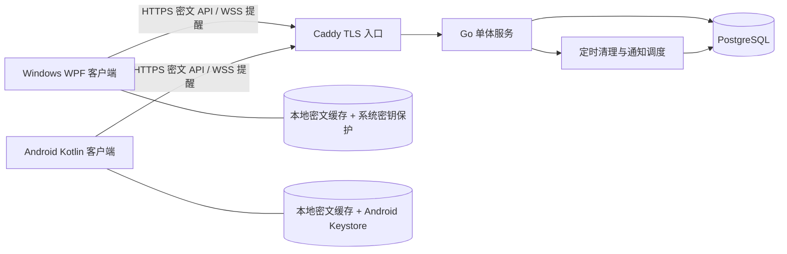

# 02 · 系统架构与模块设计

## 1. 部署结构



服务端内部采用模块化单体，同一进程中组织账号、保险库、条目、同步和清理作业。首版只需一个应用实例、一个 PostgreSQL 和一个 TLS 入口。不引入消息队列、Redis、对象存储，降低自托管安装和备份复杂度。

## 2. 技术选型

| 部分 | 基线 | 理由与实施说明 |
| --- | --- | --- |
| 服务端 | Go 1.26、标准库 `net/http` | 单二进制、资源可控；骨架零第三方依赖；后续显式加入 PostgreSQL 驱动、迁移工具、WebSocket 和 Argon2 依赖 |
| 数据库 | PostgreSQL 17 | 事务、行锁、索引与成熟备份；存储密文、事件及会话；升级补丁在发布时锁定 |
| Windows | .NET 10 + WPF + MVVM | Win32 剪贴板消息、STA 线程、托盘和快捷键接入直接；骨架使用最小 WPF 页面 |
| Android | Kotlin 2.2.21、AGP 8.13.2、Gradle 8.13、JDK 17/21 | 固定一组可查证的构建基线；compile/target SDK 36；骨架使用 Activity，正式页面阶段加入 Compose/BOM |
| 本地存储 | SQLite 密文行 + 内存搜索索引 | 正文和离线队列加密；不创建落盘明文 FTS；可后续评估页级加密库 |
| 网络 | REST JSON + WebSocket 通知 | 拉取接口负责可靠恢复；长连接负责降低延迟，不作为唯一事件存储 |
| TLS | Caddy 2 | 域名自动 HTTPS；IP/私有 CA 方案单独配置 |

以上是项目基线，未声称都是最新版本。开工与发版时检查官方兼容和补丁支持情况，详见 [资料索引](11-references.md)。不使用 Flutter/网页容器来掩盖系统权限问题；未来可替换 UI，但协议与权限边界不变。

## 3. 服务端模块边界

| 模块 | 职责 | 禁止承担的职责 |
| --- | --- | --- |
| config | 启动配置校验、公开地址、注册模式、资源限制 | 不打印含密码的连接串 |
| httpapi | JSON/大小校验、路由、认证中间件、错误映射 | 不在 handler 中拼接业务 SQL |
| auth | 密码验证、邀请、设备会话、限流、撤销 | 不参与内容主密钥恢复 |
| vault | 保存不可解读的主密钥信封，首次初始化 CAS | 不接收恢复密钥或明文主密钥 |
| clips | 不可变密文创建、回收站状态迁移、配额 | 不进行正文搜索或内容分析 |
| sync | 同账号序号、事件查询、扫描与提醒 | 不相信客户端时间决定顺序 |
| repository | 按租户查询、事务和索引；实现领域接口 | 不绕过账号约束全库查条目 |
| jobs | 到期清理、会话/事件过期、通知补偿 | 不通过 HTTP 自调用模拟清理 |

目录中只有部分接口文件，具体模块应在对应里程碑加入；不要为每个未来模块先堆空类。

## 4. 客户端分层

```text
View / ViewModel
  ├─ AccountCoordinator：服务地址、登录、解锁、退出
  ├─ HistoryUseCases：列表、详情、本地查询、删除、恢复
  └─ SyncCoordinator：唯一串行同步状态机
       ├─ ClipboardAdapter：平台读取/监听/写入
       ├─ CryptoProvider：加解密与系统密钥保护
       ├─ LocalRepository：密文、outbox、游标、抑制标记
       └─ ServerApi + NotificationChannel：网络适配器
```

UI 不直接访问剪贴板，也不在剪贴板回调中同步请求网络。使用依赖注入及可替换时钟、网络、存储、剪贴板接口。重连、生命周期恢复和通知触发统一进入同一个协调器，避免并行上传/拉取相互覆盖。

## 5. 数据与控制流

- **正文流**：源端内存 → 客户端加密 → 本地密文 outbox → TLS → 服务端密文 → TLS → 目标端验证解密 → 系统剪贴板。
- **控制流**：服务端提交条目/状态事件 → WebSocket 发 `changes_available` → 客户端按游标拉取 → 应用当前状态。
- **查询流**：下载账号密文缓存 → 解锁后建立内存索引 → 本地过滤；搜索词不传到服务器。
- **生命周期流**：删除、恢复、永久删除都经服务端事务产生事件；离线端只保存待提交命令，不擅自决定全局状态。

## 6. 扩展与故障边界

- 首版单应用实例；进程内 WebSocket hub 的通知可丢，定期在线补拉保证收敛。多实例时使用 PostgreSQL NOTIFY 或消息中间件做提示传播，持久事件表仍是事实来源。
- 数据库不可用时写入不能返回成功；客户端继续密文排队。`/healthz` 只反映进程，正式版 `/readyz` 检查数据库、迁移版本、密钥配置与作业启动。
- 配额在同账号事务锁内核算，不用“先查后写”的非原子流程。大账号限流避免一个用户占满数据库。
- TLS 在 Caddy 终止，内网 API 仅容器网络可达。若数据库或 API 跨机器，另启用内部 TLS/受控专网。
- API v1 只部署于地址根路径，不支持 `/clipboard/` 子路径代理；未来如需子路径要同步改客户端地址解析、OpenAPI 与代理规则。

## 7. 代码交付边界

本轮仅有：Go 可启动外壳、领域接口、SQL 模型草案、客户端入口、协议文件、部署模板及开发说明。业务接口默认失败，`server-info` 明示 `stage=skeleton`、`sync_available=false`。没有生成真实账号或采集用户剪贴板，后续应按 [开发计划](09-development-plan.md) 逐个实现。
