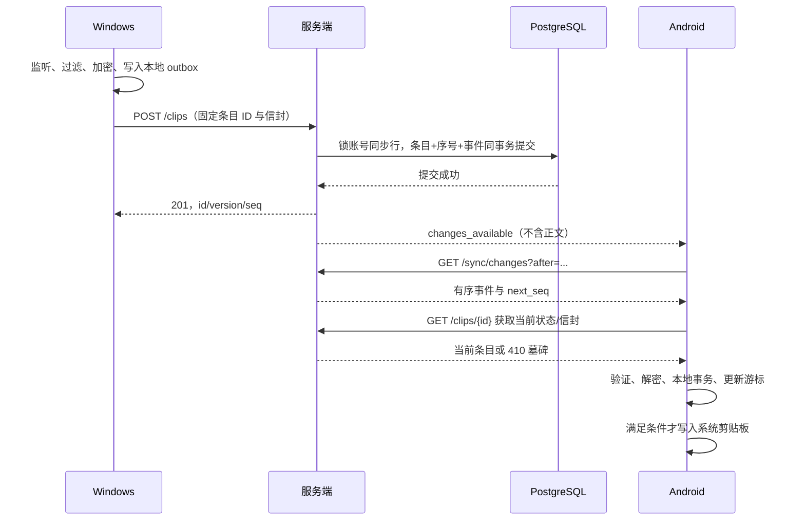

# 04 · 同步协议与一致性

## 1. 基础语义

- 服务端是条目生命周期的事实来源；客户端是正文的加解密端。
- 传输至少一次，创建及操作必须幂等。WebSocket 仅提示有新变化，断连不能造成永久漏数据。
- 每账号独立单调 `seq`，JSON 用十进制字符串，数据库用 BIGINT；不要经 JavaScript 浮点数转换。`version` 是同一条目的正整数版本。
- `sync_epoch` 是服务实例的随机世代 UUID，持久保存；灾难恢复或事件历史重置时显式更换。游标实际为 `(server origin, user_id, sync_epoch, seq)`。
- 条目正文不可变。`clip.created`、`clip.trashed`、`clip.restored`、`clip.purged` 只改变条目状态/版本，状态事件不复制密文到事件表。

## 2. 正常在线路径



## 3. 本地采集和防循环

1. 仅在用户启用、账号解锁、平台允许时采集。应用启动时已有剪贴板不自动上传；首次变化/显式操作才触发。
2. 回调只把候选采集任务放串行队列；读取、过滤和加密在允许的线程执行，网络不阻塞回调。
3. 保存本地单调 `clipboard_generation`。用户真实新复制使其增加；纯文本完整保留。
4. 远程写入前记录预期文本的本地 HMAC、条目 ID、有效时间（初始 2 秒）及预期系统序号；平台支持时同时附自定义来源格式。实际观察到匹配的写入通知才消耗标记。
5. 匹配预期远端写入不创建 outbox；不匹配的新文本仍采集。Windows 同一消息重复通知可用系统剪贴板序号去重；Android 用单次抑制标记和短窗口去重。
6. 不依赖明文 SHA-256 全局去重；同样的文字稍后再次复制必须仍可同步。Android 对极短窗口内完全相同的人为复制难以和回调区分，此局限要测试并记录。
7. 本机来源事件只更新服务器确认信息，不重新写本机剪贴板。历史列表点击“复制到本机”也走抑制标记，默认不再次上传。

## 4. 自动写入资格

历史同步和写系统剪贴板是两个动作。一次成功拉取不一定应写剪贴板。

仅当以下条件全部满足，选择本次事件中序号最高的合格 `clip.created`：

- 不是本设备创建，且当前条目仍 active、信封版本可支持、解密成功；
- 当前处于已完成追赶后的实时连接状态；不是登录、重连、解锁、全量扫描或手动“同步历史”产生的补偿；
- 源端本次创建标记 `delivery_intent=live`，并且接收端基于本次服务端 `server_time` 判断 `created_at` 距今 ≤30 秒；
- 来源端只有在采集后单调时钟 ≤30 秒、网络已连通时才能为首次发送选择 live；离线队列、进程恢复队列首次发送一律 `history_only`；已开始的请求重试原信封/原 intent，禁止改变请求身份；
- 用户启用自动写入、设备解锁、平台可执行，并且自本轮拉取开始到真正写入前本地 `clipboard_generation` 未改变；
- 已应用当前条目的更新版本，写入前再检查本地是否收到了删除/更新。远端紧邻删除与系统写入无法做到跨系统原子性；删除历史不等于撤回已复制文本。

持续连接下并发电脑/手机复制仍可能互相竞争；采用服务器顺序和本地复制优先保护，不宣称多设备剪贴板强一致。所有内容保留在历史供选择。恢复旧条目不会产生自动写入；离线内容即使“服务器最后收到”，也不能覆盖最新使用中的剪贴板。

后台 Android 无法读取当前内容时无法可靠检查本地变化；普通模式默认关闭后台自动写入，只更新历史并提供用户点击复制。可选实验模式须独立说明、真机验证和用户启用。

## 5. 事务序号与事件

不能把 PostgreSQL `BIGSERIAL` 或 `nextval()` 直接当提交顺序游标：事务 A 分配 10 后未提交，B 分配 11 并提交，客户端推进到 11 后会漏掉 A。

每个写操作在 READ COMMITTED 事务中：

```text
BEGIN
  SELECT next_seq FROM user_sync_state WHERE user_id=:authenticated_user FOR UPDATE
  检查幂等登记、设备状态、对象所有者、预期版本、配额
  若重复：返回原操作结果，不再次递增序号
  UPDATE user_sync_state SET next_seq=next_seq+1 ... RETURNING next_seq
  修改条目/状态，分配同一 seq
  INSERT sync_events(user_id, seq, clip_id, kind, version, occurred_at)
  保存幂等结果、更新字节数和条数
COMMIT
提交后触发通知（失败也不回滚已确认写入）
```

同账号写锁持有到提交，保证可见提交顺序。所有生命周期、清理和设备撤销的相关写事务遵循固定锁顺序：账号同步行 → 设备/会话 → 条目 → 操作记录。清理不能先锁条目再锁账号造成死锁。不同账号可并行。

事件无密文；客户端按事件 ID 获取条目**当前**版本。遇到删除至 purged 的旧 create 事件直接应用墓碑，不要求服务端恢复历史密文。同页同 ID 可合并，保留最大版本；后续旧事件不得使版本回退。

## 6. 增量拉取

`GET /sync/changes?epoch=...&after=42&limit=100`：

```json
{
  "sync_epoch": "33333333-3333-4333-8333-333333333333",
  "events": [
    {"seq":"43","clip_id":"44444444-4444-4444-8444-444444444444","kind":"clip.trashed","version":2,"occurred_at":"2026-09-15T03:00:00Z"}
  ],
  "next_seq": "43",
  "high_watermark": "43",
  "has_more": false,
  "server_time": "2026-09-15T03:00:01Z"
}
```

服务端在同一个短数据库一致性读事务内取得高水位 H，并返回 `after < seq <= H`、升序、有上限的事件。非空 `next_seq` 为最后返回事件；空页为输入 after，不跳过尚未分页返回的事件。返回 `has_more` 后立即继续分页。

客户端在本地事务中提交条目/墓碑、隔离记录和游标。崩溃后重复应用是安全的。某条密文损坏时保存隔离记录与错误，仍可推进该批已持久保存事件的游标；不能直接丢弃它，也不能无限卡住其他条目。网络失败导致无法取得当前对象时不推进该页游标。

事件保留默认 30 天。`min_available_seq` 指仍可拉取的最早序号；当 `after < min_available_seq-1` 返回 410 `CURSOR_EXPIRED`。世代不匹配、游标高于服务器当前高水位返回 409 `SYNC_RESET_REQUIRED`，要求全量校准，禁止直接取较大值。

## 7. 首次加载和游标过期重建

采用“有边界的扫描 + 事件补偿”，不用跨 HTTP 请求持有数据库事务。

1. `POST /sync/snapshots` 返回随机短期扫描 token、固定 `base_seq=H`、世代、15 分钟到期时间。token 与用户/设备绑定，仅存摘要。
2. 按 `clip_id` 的稳定键集顺序分页，筛选 `created_seq <= H` 且当前尚有可见正文的 active/trash；每页查询当前版本。token 固定 H，分页 token 绑定账号/H/末尾 ID/到期时间。
3. 扫描是收敛扫描，不是同一时刻的 MVCC 快照；期间删除、恢复会改变结果。`created_seq` 永不修改，ID 排序不变，扫描期间变化由 H 之后事件补齐。新增 `created_seq > H` 不进入扫描，依赖增量事件。
4. 客户端写入临时远端缓存，然后从 H 拉取事件，按最大版本合并到本次追赶高水位。处理 purged/trashed，不能因看见旧事件降低扫描已读到的版本。
5. 仅在扫描与补偿全部成功后，在本地事务中替换已确认远端缓存及游标。**保留尚未提交的 outbox/操作队列**，它们是独立表，不能被缓存替换删除。
6. 原缓存里不在重建结果中的已确认条目删除；因此即使 30 天事件已经清理，旧设备也不会让被删历史复活。全量重建不触发系统剪贴板写入。
7. 扫描过期、期间日志被截断到 H 之后或世代变化，返回 410/409，废弃临时缓存并重来；客户端持续可查看旧缓存，但显示“正在重新校准”。

## 8. 幂等、冲突与离线

| 操作 | 规则 |
| --- | --- |
| 创建 | `(user_id, clip_id)` 永久唯一登记；相同 request_hash 重试返回原创建收据；不同信封/意图/来源 409 |
| 删除/恢复/永久删除 | `Idempotency-Key` UUID + 请求摘要，保存 30 天操作收据；同 key 不同请求 409 |
| 状态并发 | `If-Match: "version"` 必填；先提交者成功，后者 412；客户端展示当前状态，不盲目重试改变用户意图 |
| 重复删除 | 不刷新 deleted_at；同操作重试返回原收据；另一个操作持旧版本返回 412 |
| 创建已永久删除 ID | 相同创建重放只返回原收据，不恢复内容；客户端随后查询当前状态得到 410；不同正文同 ID 409 |
| 过期操作重放 | 先校验当前 version/墓碑；返回冲突或当前最终态，不重新延长回收站期限 |
| 退出/切换服务器 | 停止协调器；未提交队列显式告知数量，用户可选择保留加密待处理数据或确认清除 |

创建 ID 登记只保留 ID、摘要、原创建收据和必要墓碑，账号存续期间保留，避免极久离线队列重试时复活已删项。客户端不得把缓存扫描得到的所有条目当待上传任务；只有真实本地复制产生 outbox。

重试使用指数退避 + 随机抖动（初始 1 秒，最大 60 秒）；429 尊重 Retry-After。401 只协调刷新一次；403 设备撤销停止同步；409/412 显示冲突；413 跳过并提示；5xx/网络错误保留队列。

## 9. WebSocket 与补偿调度

事件示例：`{"type":"changes_available","sync_epoch":"...","high_watermark":"43"}`。允许重复和合并，客户端始终依据自己的持久游标拉取。连接建立先追赶再标记 LIVE；断线立刻退出 LIVE。

服务端 30 秒 ping，60 秒无 pong 关闭；客户端前台/Windows 在线时每 60 秒执行一次补拉，弥补通知丢失。Android 后台周期任务只作系统允许时的最终补偿，不承诺秒级。应用回前台、网络恢复、解锁、通知点击都触发同一补偿入口。

首版不提供目标设备的远程“已粘贴”回执，因为读取用户是否在第三方应用粘贴不可可靠获知。来源端最多显示“已保存到服务器”；目标端显示自身写入结果。
