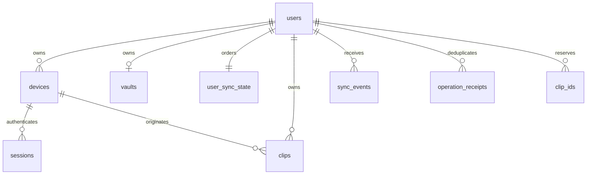
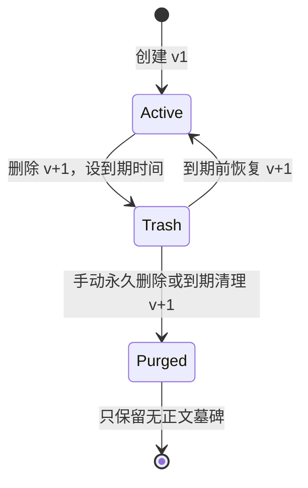

# 05 · 数据模型与回收站

## 1. 关系与约束



初始 SQL 草案位于 [000001_initial.sql](../server/migrations/000001_initial.sql)。SQL 提供表、索引和部分 CHECK/复合外键；事务顺序、跨表配额、版本递增、事件写入和权限校验需要应用实现。当前服务不会自动运行迁移或访问数据库。

## 2. 服务端表说明

| 表 | 关键字段与用途 |
| --- | --- |
| users | UUID、标准化登录名、密码哈希、可选 email、auth_provider（local/external）、external_subject、状态、created_at；本地登录名 3–32 位 ASCII 小写字母/数字/下划线 |
| devices | `(user_id,id)`、用户自定义 name、platform、created_at、last_seen_at、revoked_at；逻辑撤销保留来源关系 |
| sessions | access_hash、refresh_hash、family_id、expires_at、refresh_expires_at、revoked_at；绑定 user/device |
| used_refresh_tokens | 已消费 refresh_hash、family_id、绝对到期时间；用于检测令牌重用 |
| registration_invites | token_hash、到期和消费时间；单次消费与用户创建同事务 |
| vaults | 每用户唯一保险库；format、epoch、RK 包装字段，以及可选 password_wrap（argon2id 参数与密文）；无明文密钥 |
| email_codes | 邮箱注册验证码摘要、尝试次数、发送与过期时间 |
| user_sync_state | next_seq、min_available_seq、ciphertext_bytes、item_count；同账号事务行锁的锚点 |
| clip_ids | 用户/条目永久 ID 登记、请求摘要、原创建序号、原创建时间、最终版本/最终序号/清理时间；无正文 |
| clips | 用户/条目、来源设备、保险库、epoch、nonce、ciphertext、version、created_seq、last_seq、状态和生命周期时间 |
| sync_events | `(user_id,seq)`、clip_id、kind、version、occurred_at；无密文；按账号增量读取 |
| operation_receipts | 用户、operation_id、request_hash、响应状态、无正文响应 JSON、到期时间；30 天幂等记录 |
| snapshot_sessions | 用户/设备、token_hash、base_seq、sync_epoch、到期时间；15 分钟扫描会话 |
| server_state | 单行 sync_epoch、服务标识、安装时间；生产安装生成，不把模板 UUID 当真实值 |

数据库 UUID 使用 uuid 类型；JSON 中表示字符串。所有时间为 TIMESTAMPTZ，用 UTC；seq 为 BIGINT，接口使用十进制字符串。密文与 nonce 在库内使用 BYTEA，HTTP 用 base64url。默认不记录正文长度，仅密文长度用于配额。

### 租户隔离

条目、设备、保险库使用带 user_id 的复合外键，防止把 A 用户条目关联到 B 用户设备。所有查询必须 `WHERE user_id = authenticated_user_id`；应用仓储接口必须传入认证 Scope，不能只传裸 ID。独立只读/迁移/运行数据库账号在正式部署阶段配置，运行账号不得有建表或超级用户权限。

## 3. 索引与容量

- active/trash 列表：`(user_id, status, created_seq DESC, id)`。
- 回收站扫描：`expires_at` 部分索引，限定 status=trash。
- 增量：`PRIMARY KEY(user_id,seq)`，并按 occurred_at 做保留清理。
- 扫描：`(user_id,id)` 主键，created_seq 过滤；10,000 条配额下可接受，压测后评估覆盖索引。
- 会话令牌摘要唯一索引，设备/账号撤销查询索引。
- 内容额度计算 `octet_length(ciphertext)`，包括 16 字节标签，不包括 base64 膨胀。事务内维护计数并每日校验；活跃+回收站均计数，purge 后释放。
- 100 用户 × 10,000 条 × 平均 2 KiB 密文约 2 GiB 原始密文，另计索引、事件、WAL、备份；这只是容量估算，不能当实际磁盘占用承诺。

## 4. 生命周期



| 操作 | 前置条件 | 事务效果 |
| --- | --- | --- |
| 删除 | active，version 匹配 | status=trash；deleted_at=DB clock；expires_at=deleted_at+168h；version/seq+1；事件 |
| 恢复 | trash 且 DB 当前时间 < expires_at，version 匹配 | active；清空 deleted_at/expires_at；version/seq+1；事件；created_at 不变 |
| 永久删除 | trash，version 匹配；或清理作业到期 | 删除 clips 密文行；在 clip_ids 标记 purged 与最终版本；事件；释放额度 |

**时间边界：**恢复时必须在获取行锁后再使用 `clock_timestamp()` 判断，不能使用事务开始前缓存的应用时间；`now()` 固定于事务开始，长时间等待锁可能导致错误恢复。等于 expires_at 时已经过期。服务端对过期回收站条目立即拒绝正文下载/恢复，即使后台清理尚未执行。

回收站列表可以展示无正文“待清理”元数据，但不能把已过期密文继续发给客户端。客户端离线缓存按最近服务器时间估计禁用恢复，真正结果仍以服务器为准；离线设备在获知删除之前无法被服务器即时擦除。

## 5. 清理作业算法

初版作业随 Go 服务运行，每分钟触发；目标到期后 5 分钟内完成在线密文删除。不是部署一个 cron 命令直接删表。

```text
每分钟：
  不加条目行锁地选取有到期记录的 user_id，分批处理
  对单个用户 BEGIN
    先锁 user_sync_state FOR UPDATE
    再锁最多 100 条到期 trash（按 expires_at,id 排序）
    持锁后逐条复核状态和 clock_timestamp()
    每条删除密文、更新无正文墓碑、递增 seq、写 purge 事件、更新配额
  COMMIT
  提交后通知在线设备
```

多 worker 以后可在**账号工作分配层**使用 SKIP LOCKED，保持固定锁顺序。重复运行没有额外事件；中断回滚后下次重试。恢复与清理竞争只有一个事务成功，不能恢复已经清理的密文。限制单轮时间/条数，失败记录无正文错误并重试。

清理事件 30 天后可裁剪，clip_ids 的无正文 ID 登记保留至账号删除。事件裁剪时同步更新 min_available_seq；清理需使用与拉取一致的读写事务边界。离线超过保留期必须全量校准。

## 6. 本地数据库建议

| 表 | 内容 |
| --- | --- |
| account_profiles | 规范化 origin、用户 ID、设备 ID、保险库 ID、系统保护的凭据引用 |
| cached_clips | 远端信封、状态、版本、服务器时间；明文不落盘 |
| outbox | 本地创建 ID、固定信封、request_hash、重试状态；和缓存分开 |
| pending_operations | 删除/恢复等 intent、expected_version、operation_id |
| sync_state | 世代、游标、连接模式、扫描中间状态 |
| quarantined_items | 失败信封/错误码，可诊断重试，不含正文日志 |

本地搜索索引在解锁后按需重建；本地库迁移失败要保留原库并进入恢复模式，不能清空未上传队列。退出前显示未提交数量；切换 origin 永不携带原服务器令牌。
