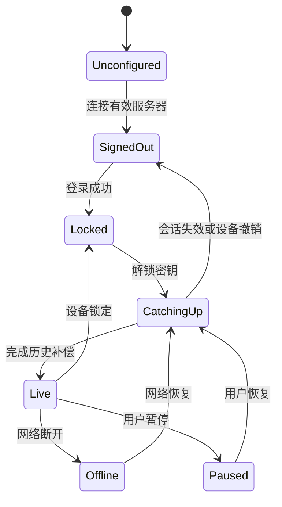

# 07 · Windows 与 Android 客户端设计

## 1. 页面与交互

```text
连接服务器
  └─ 注册 / 登录
       └─ 初始化保险库 / 输入恢复密钥
            └─ 历史
                 ├─ 搜索、日期/设备筛选、详情、复制、删除
                 ├─ 回收站：剩余时间、恢复、永久删除
                 ├─ 设备：名称、平台、最近活动、撤销
                 └─ 设置：服务器、采集、自动写入、隐私、锁定、退出
```

### 核心页面规范

| 页面 | 内容与状态 |
| --- | --- |
| 服务器 | 地址输入、连接测试、证书错误、服务版本、是否可用；不让用户填写 API 路径 |
| 账号 | 登录名、密码、邀请注册入口；登录后已有保险库直接要求恢复密钥，不误初始化 |
| 密钥 | 说明登录密码与恢复密钥区别；保存确认；错误密钥明确提示；不显示加密成功假状态 |
| 历史 | 顶部同步/锁定状态、待上传数；本地搜索；条目预览、时间、来源设备；无内容/加载/错误分别展示 |
| 详情 | 纯文本、不执行 HTML；复制成功/系统拒绝反馈；删除进入回收站 |
| 回收站 | 删除时间、服务器到期时间、恢复；永久删除说明不可从在线服务恢复，二次确认 |
| 设置 | 采集与接收写入独立开关；暂停 15 分钟/直到恢复；敏感内容策略；缓存清除；未上传数提示 |

搜索栏显示“搜索已下载的 1,280 / 3,400 条”，锁定时不可搜索正文；可继续下载加密数据取决于本地保护策略。设备名视为服务端可见元数据，避免默认发送完整 Windows 主机名。

## 2. 客户端状态机



平台采集能力另设 `CanReadClipboard`、`CanWriteClipboardNow`、`BackgroundNetworkAvailable`，不与账号 LIVE 状态混为一谈。屏幕“同步中”不能代表 Android 后台有读取权限。

## 3. Windows 实现指导

### 3.1 剪贴板接入

- WPF 获取 HWND 后 `AddClipboardFormatListener`，接收 `WM_CLIPBOARDUPDATE`；退出调用 RemoveClipboardFormatListener。相关 Win32 官方资料见 [参考](11-references.md)。
- 读写必须在 STA/UI Dispatcher 上调用；回调不做 HTTP、数据库或长文本索引。使用 `GetClipboardSequenceNumber` 辅助防重复。
- Clipboard 被其他程序短暂占用时捕获异常，进行有界重试（如 20/50/100/200ms）；重试前确认序号未被新复制取代，避免读错事件。
- 只接收 `CF_UNICODETEXT` / Text；提取后校验严格 UTF-8 长度，不读取文件拖放或截图。用户只复制 HTML 但同时有纯文本时，只上传纯文本表示。
- 远端写入使用预期指纹/序号及可选自定义格式，防止监听回调再次上传。

### 3.2 生命周期与桌面体验

- 客户端运行在交互用户会话，不实现为 Session 0 Windows 服务；服务方式无法代替当前用户桌面剪贴板。
- 后续加入托盘、单实例互斥锁、重复启动唤起窗口、明确退出菜单；关闭窗口是否最小化到托盘应首次提示。
- 开机启动通过用户设置开启；启动后锁定密钥/尊重用户隐私开关。睡眠恢复走 CatchingUp，不直接写旧条目。
- Windows 锁屏会话通知后停止自动写入，清理明文搜索索引；解锁重新校准。复制失败只报告本机状态，不误报网络失败。
- 快捷键可用于打开历史/暂停，不抢占系统常用快捷键；先为冲突提供反馈。
- 安装包先提供签名 x64 包；自动更新必须校验发行签名，安装来源独立于用户自托管服务器，防止服务器推送任意可执行文件。

### 3.3 骨架

`clients/windows/OnlineClipboard.Windows` 已有 WPF 入口、占位页面和接口。没有注册系统监听或读取用户剪贴板；正式实现从接口后接入，保证 UI 不直接耦合网络。

## 4. Android 平台能力

### 4.1 普通模式（P0）

Android 10+ 只有具有焦点的应用或默认输入法等符合系统条件的组件能读取剪贴板。前台服务通知不是“界面拥有焦点”，`READ_CLIPBOARD_IN_BACKGROUND` 不是普通应用可以向用户申请获得的常规运行时权限。监听器同样受限制。[官方说明](https://source.android.com/docs/whatsnew/android-10-release)

- `Activity` 仅在实际窗口有焦点且启用采集时读剪贴板；`onResume` 本身不保证已获得窗口焦点，应结合 `onWindowFocusChanged`。
- 支持 Android Sharesheet `ACTION_SEND`、MIME `text/plain`，用户确认后上传；处理有界 EXTRA_TEXT，不读取任意外部 URI。
- 手机回前台时补拉历史；用户点“复制”调用 setPrimaryClip；前台自动写入按 [同步条件](04-sync-protocol.md) 执行。
- 后台接收成功和后台可写剪贴板分开验证；API 的读限制不能直接当作写限制结论。由于进程/网络调度不可保证，普通模式默认不做后台自动写入。
- 通知按钮建议打开 Activity 再复制；Android 13+ 通知权限被拒绝时，前台路径仍可用。通知不含文字预览。

### 4.2 后台策略

Doze/待机可能延后网络和 WorkManager；WorkManager 用于最终补偿，不是实时通道。[官方调度说明](https://developer.android.com/training/monitoring-device-state/doze-standby)

不要设计永久 `dataSync` 前台服务维持连接。针对 Android 15+ 的该类型后台执行有时长限制，并限制开机广播启动；前台服务也不能解除剪贴板读取限制。[官方行为变更](https://developer.android.com/about/versions/15/behavior-changes-15)

首版无需 FCM/GMS/厂商账号：前台 WSS、回前台补拉、系统允许的任务补偿。未来可接入可选外部推送，只发送唤醒/版本提示，不发送正文或解密密钥；没有推送时仍能自托管使用。不能把“请求忽略电池优化”当保证永驻的开关。

### 4.3 默认输入法增强（P1，先做 M0 PoC）

用户主动把本应用设为默认 IME 后，可在系统允许的输入法上下文读取剪贴板；键盘展开时主动拉取最新历史，并提供明确的“同步文字”候选。它不是某个任意开关权限，需用户改变输入方式。

需要验证：未展开键盘时进程存活、后台读取回调、后台写入、锁屏、Doze、切换输入法、不同厂商系统以及长按系统粘贴。键盘候选点击 `commitText()` 是一种替代操作，不应被验收为“系统直接粘贴已实现”。IME 的开发还涉及完整可用输入体验、密码字段禁用候选、键盘切换和隐私信任成本。[IME 官方指南](https://developer.android.com/develop/ui/views/touch-and-input/creating-input-method)

不在首版要求 root、ADB、Shizuku、无障碍读取或隐蔽悬浮窗。若以后研究这些方式，单列实验版本与适用设备，不作为普通用户默认安装步骤。

### 4.4 存储、构建和发布

- minSdk 29，骨架 target/compile SDK 36。发布前按最新平台和分发规则复核 targetSdk，而不是永久停留在旧版本规避限制。
- Android Keystore 包装本地随机密钥；密钥失效/设备恢复导致不能解密时，进入重新登录和恢复密钥解锁，保留可诊断状态。
- Manifest 不声明尚未实现的前台服务/输入法/无障碍组件；INTERNET 仅为未来网络用途；release 明文流量默认禁止。
- 不备份私密缓存；将本地密钥与账号配置和备份规则一起测试。锁屏后不自动显示/写入明文。
- APK 使用稳定签名密钥，离线安全备份；自托管服务器网址是运行时配置，不需要用户重编译 APK。Windows 配置同理。

## 5. 服务器地址与错误体验

规范 origin 为 scheme + 主机 + 有效端口，去掉根路径末尾斜线，不允许 userinfo/query/fragment/非根 path。无协议输入如 `192.168.1.20:8443` 默认加 `https://`；IPv6 要求 `[2001:db8::20]:8443`。生产禁止静默降级 HTTP。

依次区分 DNS 无法解析、TCP 不通、TLS 证书不受信/名称不匹配、HTTP 路径错误、server-info 不是本产品、版本不兼容、业务尚未就绪。切换服务器先暂停旧队列，不将旧服务器令牌发给新主机。生产不提供“跳过证书校验”。
